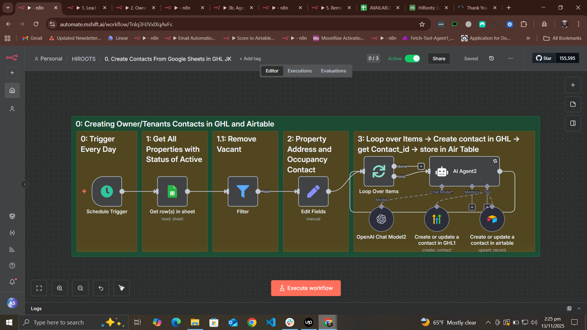
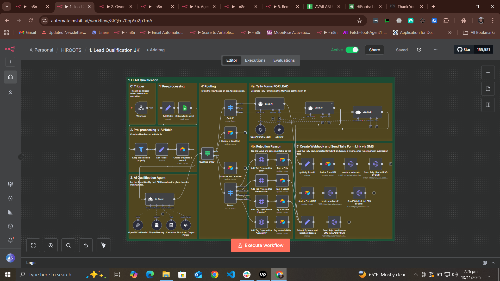
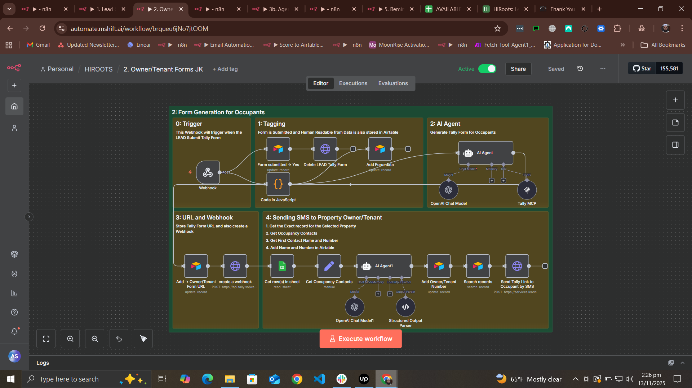
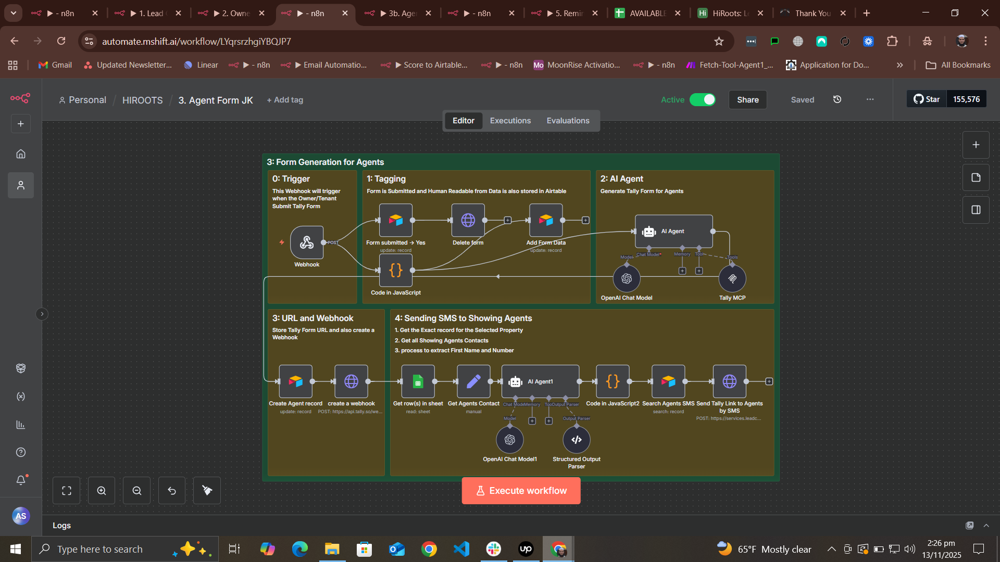
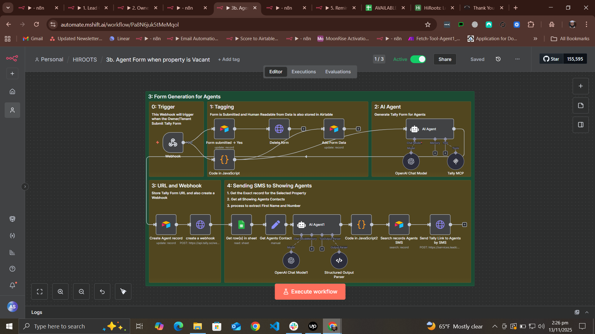
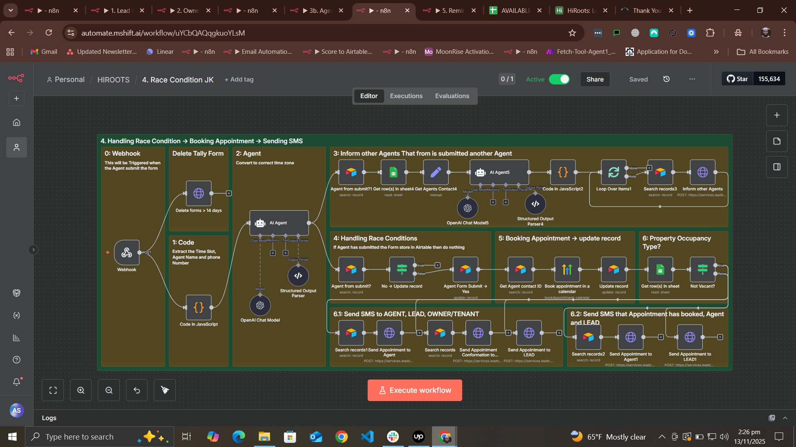
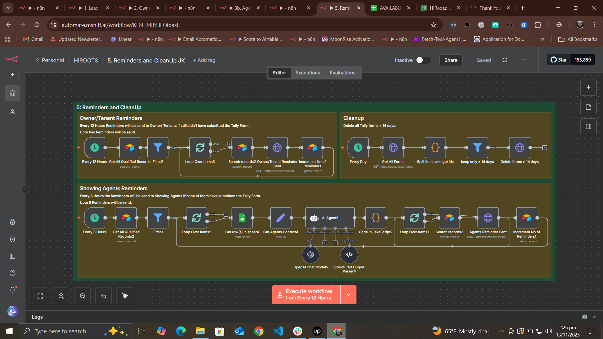

# HiRoots Property Showing Automation System

A comprehensive n8n-based automation system that streamlines the property showing coordination process for rental properties. This system manages lead qualification, availability coordination, and appointment scheduling between leads, property owners/tenants, and showing agents.

## 🎯 Overview

This automation system handles the complete workflow of scheduling property showings:

1. **Lead Qualification** - Automatically qualifies leads based on credit score, income, pet policies, and move-in dates
2. **Contact Management** - Creates and syncs contacts between GoHighLevel (GHL) and Airtable
3. **Form Generation** - Dynamically generates Tally forms for availability collection using AI
4. **Availability Coordination** - Collects and matches availability from leads, property owners/tenants, and agents
5. **Appointment Booking** - Automatically books appointments in GHL calendar when all parties confirm
6. **Smart Reminders** - Sends automated reminders to ensure form completion
7. **Race Condition Handling** - Manages concurrent form submissions from multiple agents

## 🏗️ System Architecture

### Workflow Files

1. **`0. Create Contacts From Google Sheets in GHL JK.json`**
   - Syncs property data from Google Sheets
   - Creates owner/tenant contacts in GHL and Airtable
   - Runs daily to keep contact information updated

2. **`1. Lead Qualification JK.json`**
   - Webhook-triggered qualification system
   - AI-powered decision making for lead qualification
   - Generates customized Tally forms based on property occupancy status
   - Routes qualified/rejected leads appropriately

3. **`2. Owner_Tenant Forms JK.json`**
   - Generates availability forms for property owners/tenants
   - Collects up to 3 time slot preferences
   - Triggers agent form generation upon submission

4. **`3. Agent Form JK.json`**
   - Creates forms for showing agents
   - Collects single time slot selection + phone number
   - Distributes forms to all available agents

5. **`3b. Agent Form when property is Vacant.json`**
   - Specialized workflow for vacant properties
   - Bypasses owner/tenant coordination
   - Direct agent scheduling

6. **`4. Race Condition JK.json`**
   - Handles concurrent agent form submissions
   - Books appointment with first responding agent
   - Notifies other agents that slot is filled
   - Sends confirmation SMS to all parties

7. **`5. Reminders and CleanUp JK.json`**
   - Sends periodic reminders for incomplete forms
   - Owner/Tenant: 2 reminders (every 12 hours)
   - Agents: 8 reminders (every 3 hours)
   - Deletes Tally forms older than 14 days

## 📸 Workflow Visualizations

### Workflow 0: Contact Synchronization

*Daily sync of property owner/tenant contacts from Google Sheets to GHL and Airtable*

### Workflow 1: Lead Qualification System

*AI-powered lead qualification with dynamic form generation based on property status*

### Workflow 2: Owner/Tenant Availability Forms

*Collects availability from property owners/tenants and triggers agent coordination*

### Workflow 3: Agent Form Distribution

*Distributes availability forms to all showing agents for occupied properties*

### Workflow 3b: Vacant Property Agent Forms

*Streamlined agent scheduling for vacant properties (bypasses owner/tenant step)*

### Workflow 4: Race Condition Handler & Booking

*Manages concurrent agent responses, books appointments, and notifies all parties*

### Workflow 5: Reminders & Cleanup

*Automated reminder system and form cleanup for optimal system maintenance*

## 🔧 Technology Stack

- **n8n** - Workflow automation platform
- **Google Sheets** - Property listings database
- **Airtable** - CRM and data storage (Leads, Agents, Owners/Tenants)
- **GoHighLevel (GHL)** - Contact management and calendar booking
- **Tally.so** - Dynamic form generation
- **OpenAI GPT-4** - AI-powered decision making and data extraction
- **Tally MCP** - Form generation via Model Context Protocol

## 📋 Prerequisites

- n8n instance (self-hosted or cloud)
- Google Sheets with property listings
- Airtable workspace with configured bases
- GoHighLevel account with API access
- Tally.so account with API credentials
- OpenAI API key

## 🚀 Setup Instructions

### 1. Import Workflows

Import all JSON files into your n8n instance:
- Navigate to n8n dashboard
- Click "Import from File"
- Upload each workflow file

### 2. Configure Credentials

Set up the following credentials in n8n:

**Google Sheets OAuth2**
- Authorize access to your property listings spreadsheet

**Airtable Token**
- Create API token with access to your bases
- Configure for tables: Leads, Agents SMS, owners/tenants

**GoHighLevel OAuth2**
- Location ID: `**********************`
- Calendar ID: `**********************`

**Tally API**
- API Key for form generation and webhook management

**OpenAI API**
- API key for GPT-4 model access

### 3. Configure Data Sources

**Google Sheets Structure:**
- Sheet name: "Current Listings"
- Required columns:
  - Property Address
  - Listing Status (ACTIVE/INACTIVE)
  - Credit Score (minimum required)
  - Pets (Yes/No)
  - Rent
  - Available Date
  - Occupancy (Owner/Tenant/Vacant)
  - Occupancy Contact
  - Showing Agents

**Airtable Base Structure:**

*Leads Table:*
- ID, First Name, Last Name, Phone Number, Email
- Income, Credit Score, Has Pets, Selected Property, Move In Date
- Status, Rejection Reason
- LEAD Form URL, LEAD Form Submitted?, LEAD Form Data
- Owner/Tenant Form URL, Owner/Tenant Form Submitted?, Owner/Tenant Form Data
- Agent Form URL, Agent Form Submitted?, Agent Form Data
- Owner/Tenant Name, Owner/Tenant Number
- Assigned Agent Number, Appointment Booked

*Agents SMS Table:*
- phone, contact_id

*owners/tenants Table:*
- Name, phone, contact_id

### 4. Update Webhook URLs

Replace webhook URLs in workflows with your n8n instance URLs:
- Workflow 1: `/webhook/dffbb075-68cc-4250-82b5-44c8a5fe5a57`
- Workflow 2: `/webhook/LEAD`
- Workflow 3: `/webhook/forms`
- Workflow 4: `/webhook/agent`
- Workflow 3b: `/webhook/formsvacant`

### 5. Activate Workflows

Activate workflows in this order:
1. Workflow 0 (Contact Sync)
2. Workflow 5 (Reminders and Cleanup)
3. Workflow 1 (Lead Qualification)
4. Workflow 2 (Owner/Tenant Forms)
5. Workflow 3 (Agent Forms)
6. Workflow 3b (Vacant Property Agent Forms)
7. Workflow 4 (Race Condition Handler)

## 📊 Data Flow
```
Lead Submission (Webhook)
    ↓
Lead Qualification (AI Agent)
    ↓
├─→ Qualified → Generate Lead Form → Lead Selects Times
│                                        ↓
│                          Property Occupancy Check
│                                        ↓
│                    ├─→ Vacant → Send to Agents Directly
│                    │
│                    └─→ Occupied → Owner/Tenant Form
│                                        ↓
│                              Owner/Tenant Selects Times
│                                        ↓
│                              Generate Agent Form
│                                        ↓
│                              Send to All Agents
│                                        ↓
│                              First Agent Responds
│                                        ↓
│                              Book Appointment
│                                        ↓
│                              Notify All Parties
│
└─→ Not Qualified → Tag & Send Rejection SMS
```

## 🎛️ Configuration Options

### Lead Qualification Criteria

Modify in Workflow 1 AI Agent system message:
- Credit score threshold
- Income multiplier (default: 3x rent)
- Pet policy matching
- Availability date comparison

### Reminder Schedules

Modify in Workflow 5:
- Owner/Tenant: Every 12 hours, max 2 reminders
- Agents: Every 3 hours, max 8 reminders

### Form Cleanup

Modify in Workflow 5:
- Default: Forms older than 14 days are deleted

## 🔍 Key Features

### AI-Powered Qualification
- GPT-4 evaluates leads against property requirements
- Automatic credit, income, pet, and availability checks
- Structured output parsing for reliable decision-making

### Dynamic Form Generation
- Tally MCP integration for programmatic form creation
- Time slot generation based on user preferences
- Multi-select for leads/owners, single-select for agents

### Race Condition Management
- First-come-first-served agent selection
- Automatic notification to other agents
- Prevents double-booking

### Smart Reminders
- Graduated reminder frequency
- Automatic reminder limits
- Form submission tracking

### Error Handling
- Retry logic on API calls
- Validation of form submissions
- Graceful failure handling

## 📱 SMS Notifications

The system sends SMS notifications at key points:
- Lead qualification result
- Form submission requests
- Appointment confirmations
- Race condition updates
- Periodic reminders

## 🔐 Security Considerations

- API keys stored in n8n credentials
- Webhook URLs should use HTTPS
- Phone numbers validated and formatted
- Contact IDs used for secure identification

## 🐛 Troubleshooting

### Forms Not Generating
- Check Tally MCP credentials
- Verify OpenAI API key has sufficient credits
- Check webhook creation in Tally

### Contacts Not Syncing
- Verify Google Sheets access
- Check Airtable API permissions
- Confirm GHL OAuth2 token is valid

### Reminders Not Sending
- Check workflow 5 is active
- Verify schedule trigger configuration
- Check SMS API credentials

### Race Condition Issues
- Ensure workflow 4 has sufficient timeout
- Check Airtable search formula syntax
- Verify agent contact IDs are correct

## 📈 Monitoring

Monitor these key metrics:
- Lead qualification rate
- Form completion rates
- Average time to booking
- Reminder effectiveness
- Agent response times

## 🤝 Contributing

This is a production system customized for HiRoots. For modifications:
1. Test in a separate n8n environment
2. Update workflows incrementally
3. Monitor execution logs
4. Document any changes

## 📝 License

Proprietary - HiRoots Property Management

## 👥 Support

For questions or issues:
- Review n8n execution logs
- Check webhook delivery status
- Verify API credentials
- Consult n8n community documentation

## 🔄 Version History

- **v1.0** - Initial production release
  - Full lead-to-booking automation
  - AI qualification system
  - Dynamic form generation
  - Race condition handling
  - Automated reminders and cleanup

---

Built with ❤️ using n8n workflow automation
